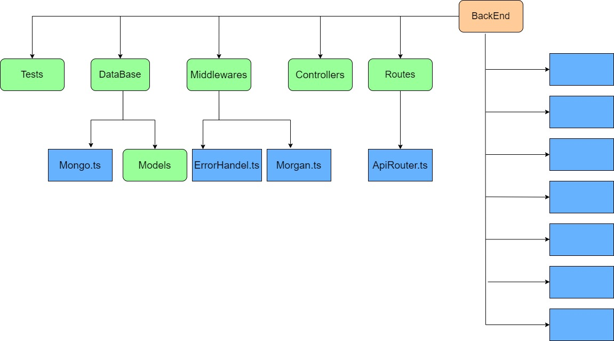
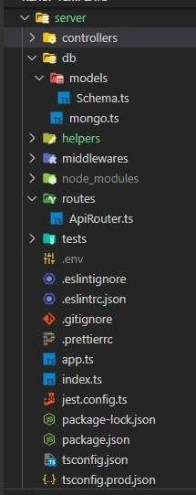

# FullStack Template

<!-- LinkedIn of creators -->

### **Creator's LinkedIn:**;

[![LinkedIn][linkedin-shield-ziv]][linkedin-url-ziv]

<!-- Alot of spaces for visuality -->

&nbsp;&nbsp;&nbsp;&nbsp;&nbsp;&nbsp;&nbsp;&nbsp;&nbsp;&nbsp;&nbsp;&nbsp;&nbsp;**⬆**

&nbsp;&nbsp;&nbsp;&nbsp;&nbsp;&nbsp;**Ziv Serphos**

<!-- [![LinkedIn][linkedin-shield-Arnon]][linkedin-url-Arnon] -->

[![Forks][forks-shield]][forks-url]
[![Issues][issues-shield]][issues-url]

<!-- PROJECT LOGO -->
 

    

<!-- TABLE OF CONTENTS -->

  
Table of Contents

  <ol>
  <li><a href="#app-diagram">App Diagram</a></li>
    <li>
      <a href="#web-page">Web page</a>
      <ul>
        <li><a href="#built-with">Built With</a></li>
          <ul>
        <li><a href="#ide">IDE</a></li>
        <li><a href="#frameworks">Frameworks</a></li>
        <li><a href="#languages">Languages</a></li>
        <li><a href="#databases">Databases</a></li>
        <li><a href="#linters">Linters</a></li>
          </ul>        
      </ul>
    </li>
    <li><a href="#backend-structure">Backend Sturcture</a></li>
    <li><a href="#client-requirements">Client Requirements</a></li>
    <li><a href="#running-tests">Running tests</a></li>
    <li><a href="#security">Security</a></li>
    <li><a href="#contacts">Contacts</a></li>
    <li>
      <a href="#features">Features</a>
      <ul>
        <li><a href="#references">References</a></li>
      </ul>
    </li>
    <li><a href="#deployment">Deployment</a></li>
  </ol>

 

## App Diagram

<!-- App Diagram -->

(<a href="#top">back to top</a>)

## Web page

<!-- Web page -->

(<a href="#top">back to top</a>)

### Built With

- #### IDE

  [![Vscode][vscode-shield]][vscode-url]

- #### Frameworks

  [![React][react-shield]][react-url]
  [![Npm][npm-shield]][npm-url]
  [![Nodejs][nodejs-shield]][nodejs-url]
  [![Jest][jest-shield]][jest-url]
  [![Cypress][cypress-shield]][cypress-url]
  [![Express][express-shield]][express-url]

- #### Languages

  [![Html5][html5-shield]][html5-url]
  [![JavaScript][javascript-shield]][javascript-url]

- #### Databases

  [![MongoDB][mongodb-shield]][mongodb-url]

- #### Linters
  [![Prettier][prettier-shield]][prettier-url]
  [![Eslint][Eslint-shield]][Eslint-url]

(<a href="#top">back to top</a>)

## Backend Structure
<b>All files and folders that are belong to backend are located in server folder.   This is the Structure</b>   

- Controllers - Responsible for all the communication between the server 

<!-- - The server should run on port `8080` serve the react app on `http://localhost:8080/` and expose those API endpoints:

* [x] (GET) api/tickets - returns an array of all `tickets` in the collection tickets in your mongoDB atlas database. If called with query param `searchText` the API will filter only tickets that have a title including a case-insensitive version of the `searchText` param.
* [x] (PATCH) `api/tickets/:ticketId` - Sets `done` property to `true` for the given ticketId - should return  
       `{updated: true}` if succeed.
* [x] (PATCH) `api/tickets/:ticketId` - Sets `done` property to `false` for the given ticketId - should return `{updated: true}` if succeed. -->

(<a href="#top">back to top</a>)

<!-- Running-tests-->

## Client Requirements

- [x] The app title should be `Tickets Manager` with a custom favicon.
- [x] The app should load (from backend) and show all Tickets.
- [x] The Ticket component should have className `ticket`.
- [x] App ticket data (received from the server) might contain `label` property (an array of strings). add those tags to the UI using elements having the `label` class.
- [x] The app should have search input with id `searchInput`. This input should request the server on `onInput` with relevant `searchText` param and update the list accordingly
- [x] Add a hide button with className `hideTicketButton` that will hide the tickets from view. Add a counter of number of hiding tickets, this counter should have a `hideTicketsCounter` className.
- [x] Add a button to restore the hidden ticket list on click with the id.

(<a href="#top">back to top</a>)

<!-- Running tests -->

## Running tests

We have created automated tests for your convenience, use it to check your progression.

Note that the automated tests rely on your code having the exact class names and Ids as specified in the Running-testssection. We encourage you to add your own tests.

- [x] To run the server and client tests simply run `npm run test` in `root` folder
- [x] To run the client tests make sure your development server (the React app) is running on port 3000 (via the `npm start script`) and then run `npm run test` from client folder

(<a href="#top">back to top</a>)

<!-- Security -->

## Security

To secure the data in your database, the contents of all the tickets should be encrypted in the DB. When someone requests data from the backend, it will be decrypted and sent plain (unless you're not using HTTPS).

Ticket metadata (`ticketId` etc.) can remain as plaintext to allow conditional queries based on the metadata.

- [x] Create a custom classical encryption algorithm of your own. Make it hard to break!

<!-- CONTACTS -->

## Contacts

**Project Creators And Division Of Labor:**

- DimaTomilin - [Github](https://github.com/DimaTomilin) **|** **Back-end** **|** Tests **|** Team Leader **|** Division Of Tasks **|** Hooks Functionalities .
- sagigolan8 - [Github](https://github.com/sagigolan8) **|** **Back-end** **|** Tests **|** MongoDB **|** Web Design + Readme File **|** Random Jokes Feature.
- zivserphos - [Github](https://github.com/zivserphos) **|** **Front-end** **|** Tests **|** Header Of The Page **|** Scroll Bar And Dark Mode Features.
- ArnonAsquira - [Github](https://github.com/ArnonAsquira) **|** **Front-end** **|** Tests **|** Footer Of The Page **|** Encryption And Dcryption Functionalities **|** Modal Feature.

(<a href="#top">back to top</a>)

<!-- Features -->

## Features

- Responsive web design .
- Dark/Light mode option.
- Styled scroll bar.
- Loading only 20 tickets every time when the **load more tickets button** clicked.
- Option to delete a ticket.
- Option to mark some ticket as done or undone and get styled alert accordingly .
- Using hooks and custom hooks.

### References

- [Dad Jokes Api](https://icanhazdadjoke.com/api)
- [React Icons](https://react-icons.github.io/react-icons/search)
- [Sweetalert2](https://sweetalert2.github.io/#examples)
- [@mui/material](https://mui.com/)
- [Bootstrap](https://getbootstrap.com)

(<a href="#top">back to top</a>)

## Deployment

- [x] [TicketsManager](https://quiet-thicket-88470.herokuapp.com) 

(<a href="#top">back to top</a>)

<!-- MARKDOWN LINKS & IMAGES -->

<!-- issues + fork -->

[issues-shield]: https://img.shields.io/badge/Issues-0-red

 <!-- PUT HERE ISSUES LINK!!!! -->

[issues-url]: https://github.com/DimaTomilin/f4s-3-ticket-manager/issues
[forks-shield]: https://img.shields.io/badge/Forks-10-green
[forks-url]: https://github.com/DimaTomilin/f4s-3-ticket-manager/network/members

<!-- LinkedIn links -->

[linkedin-shield-ziv]: https://img.shields.io/badge/-LinkedIn-black.svg?style=for-the-badge&logo=linkedin&colorA=160
[linkedin-url-ziv]: https://www.linkedin.com/in/ziv-serphos-837434226/

<!-- Badges -->

<!-- build with -->

<!-- IDE -->
[vscode-url]: https://code.visualstudio.com/
[vscode-shield]: https://img.shields.io/badge/Visual_Studio_Code-0078D4?style=for-the-badge&logo=visual%20studio%20code&logoColor=white

<!-- Frameworks -->
<!-- Nodejs -->

[nodejs-url]: https://nodejs.org/en/
[nodejs-shield]: https://img.shields.io/badge/Node.js-339933?style=for-the-badge&logo=nodedotjs&logoColor=whit

<!-- Npm -->

[npm-url]: https://www.npmjs.com/
[npm-shield]: https://img.shields.io/badge/npm-CB3837?style=for-the-badge&logo=npm&logoColor=white

<!-- Testing -->
<!-- Jest-->

[jest-url]: https://jestjs.io/
[jest-shield]: https://img.shields.io/badge/Jest-C21325?style=for-the-badge&logo=jest&logoColor=white

<!-- cypress -->
[cypress-url]: https://www.cypress.io/
[cypress-shield]: https://img.shields.io/badge/Cypress-17202C?style=for-the-badge&logo=cypress&logoColor=white

<!-- Express -->

[express-shield]: https://img.shields.io/badge/Express.js-000000?style=for-the-badge&logo=express&logoColor=white
[express-url]: https://expressjs.com/

<!--React  -->

[react-shield]: https://img.shields.io/badge/React-20232A?style=for-the-badge&logo=react&logoColor=61DAFB
[react-url]: https://reactjs.org/

<!-- Languages -->
<!-- Html5-->

[html5-url]: https://developer.mozilla.org/en-US/docs/Glossary/HTML5
[html5-shield]: https://img.shields.io/badge/HTML5-E34F26?style=for-the-badge&logo=html5&logoColor=white

<!-- JavaScript -->

[javascript-url]: https://developer.mozilla.org/en-US/docs/Web/JavaScript
[javascript-shield]: https://img.shields.io/badge/JavaScript-323330?style=for-the-badge&logo=javascript&logoColor=F7DF1E

<!-- Databases -->
<!-- Mongodb-->

[mongodb-shield]: https://img.shields.io/badge/MongoDB-4EA94B?style=for-the-badge&logo=mongodb&logoColor=white
[mongodb-url]: https://www.mongodb.com/

<!-- Linters -->
<!-- Prettier -->

[prettier-url]: https://prettier.io/
[prettier-shield]: https://img.shields.io/badge/prettier-1A2C34?style=for-the-badge&logo=prettier&logoColor=F7BA3E
[Eslint-shield]: https://img.shields.io/badge/eslint-3A33D1?style=for-the-badge&logo=eslint&logoColor=white
[Eslint-url]: https://eslint.org/

